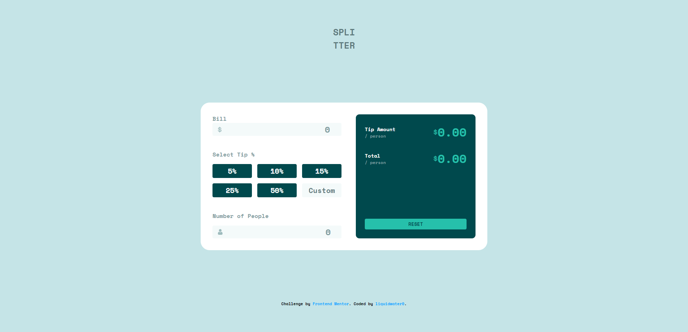

# Frontend Mentor - Tip calculator app solution

This is a solution to the [Tip calculator app challenge on Frontend Mentor](https://www.frontendmentor.io/challenges/tip-calculator-app-ugJNGbJUX). Frontend Mentor challenges help you improve your coding skills by building realistic projects.

## Table of contents

- [Overview](#overview)
  - [The challenge](#the-challenge)
  - [Screenshot](#screenshot)
  - [Links](#links)
- [My process](#my-process)
  - [Built with](#built-with)
  - [What I learned](#what-i-learned)
  - [Continued development](#continued-development)
  - [Useful resources](#useful-resources)
- [Author](#author)

## Overview

### The challenge

Users should be able to:

- View the optimal layout for the app depending on their device's screen size
- See hover states for all interactive elements on the page
- Calculate the correct tip and total cost of the bill per person

### Screenshot

### Links

- Solution URL: [Add solution URL here](https://your-solution-url.com)
- Live Site URL: [Add live site URL here](https://liquidwater0.github.io/Tip-Calculator-App/)

## My process

### Built with

- Semantic HTML5 markup
- CSS custom properties
- Flexbox
- CSS Grid

### What I learned

The only thing i've learned with this project was how to hide the default arrow buttons on number inputs. Other than that it was good to test myself.

### Continued development

I only code for fun as of right now, but I would like to focus on improving my knowledge of HTML, CSS, and JavaScript.

### Useful resources

- [w3Schools](https://www.w3schools.com/howto/howto_css_hide_arrow_number.asp) - This site helped me figure out how to hide the default number input buttons. I used this site many times when I first started coding and it's very helpful.

## Author

- Frontend Mentor - [@yourusername](https://www.frontendmentor.io/profile/liquidwater0)